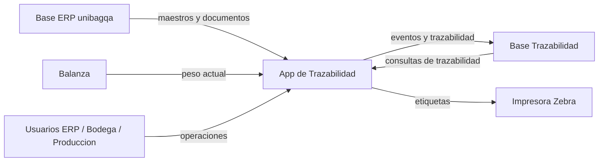
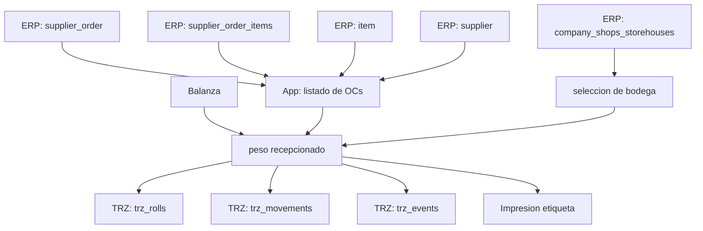
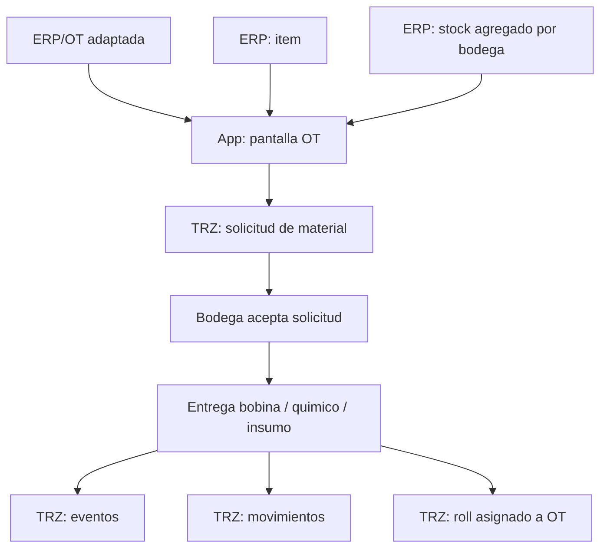
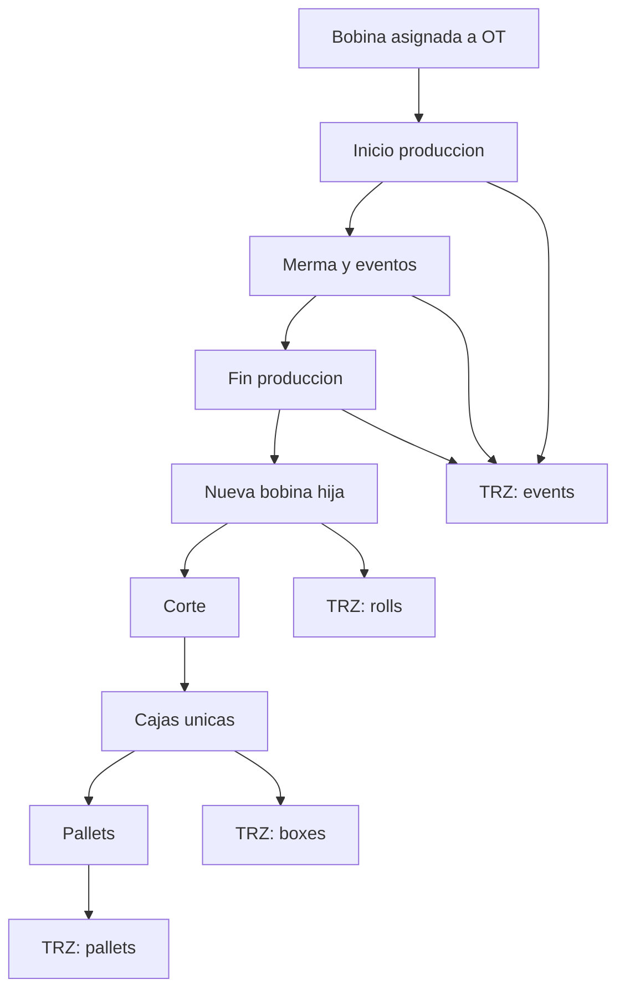

# Informe De Mapa De Datos E Integracion

## Objetivo

Este informe describe:

- como se conectan los datos del ERP `unibagqa` con el proyecto de trazabilidad
- que tablas del ERP pueden reutilizarse
- que datos faltan para cubrir la trazabilidad operativa completa
- opciones para no modificar la base de datos principal del ERP
- recomendacion de arquitectura para separar ERP y trazabilidad

---

## Resumen Ejecutivo

La base `unibagqa` si sirve como fuente principal de datos ERP.

Hoy ya contiene informacion util para:

- proveedores
- ordenes de compra
- lineas de orden de compra
- catalogo de productos
- bodegas
- stock por bodega
- usuarios ERP
- operarios
- parte del flujo productivo
- lectura de balanza

Sin embargo, `unibagqa` no trae de forma nativa toda la trazabilidad operativa que este proyecto necesita, especialmente:

- bobina unica por recepcion o por proceso
- historial detallado de movimientos por bobina
- solicitud y entrega de materiales por OT
- merma con motivo y peso por evento
- bobina de salida hija de otra bobina
- cajas unicas
- pallets
- bitacora transversal de eventos

Por eso, la recomendacion tecnica mas segura es:

- mantener `unibagqa` como base ERP fuente
- crear una base aparte para trazabilidad
- leer desde `unibagqa`
- escribir solo en la base de trazabilidad

---

## Mapa General De Origenes De Datos

### Base ERP Fuente: `unibagqa`

Tablas relevantes ya encontradas:

- `supplier`
- `supplier_order`
- `supplier_order_items`
- `supplier_order_items_specs`
- `item`
- `item_barcodes`
- `company_shops_storehouses`
- `item_shops_storehouses`
- `user`
- `workers`
- `prod_header`
- `prod_agenda`
- `prod_worker_init`
- `prod_worker_ot`
- `prod_worker_ot_events`
- `balanca_kgs`

### Base De Trazabilidad Recomendada

Propuesta de base nueva:

- `unibag_trazabilidad`

Tablas recomendadas para esta base:

- `trz_rolls`
- `trz_movements`
- `trz_events`
- `trz_work_orders`
- `trz_work_order_material_requests`
- `trz_production_wastes`
- `trz_chemical_weighings`
- `trz_boxes`
- `trz_pallets`
- `trz_auth_users` solo si no se reutiliza login ERP
- `trz_sync_log`
- `trz_erp_links`

---

## Mapeo De Tablas ERP Al Proyecto

### 1. Proveedores

ERP:

- `supplier.id`
- `supplier.supp_company`
- `supplier.supp_short`
- `supplier.supp_status`

Uso en trazabilidad:

- proveedor de la orden de compra
- nombre visible en recepcion

Mapeo recomendado:

- `supplier.id` -> `erp_supplier_id`
- `supp_company` -> `supplier_name`
- `supp_status = 1` -> activo

### 2. Ordenes De Compra

ERP:

- `supplier_order.id`
- `supplier_order.sord_number`
- `supplier_order.sord_supplier_id`
- `supplier_order.sord_status`
- `supplier_order.sord_crtdat`

Uso en trazabilidad:

- listar OCs para recepcion
- bloquear OCs completas
- filtrar por proveedor

Mapeo recomendado:

- `supplier_order.id` -> `erp_purchase_order_id`
- `sord_number` -> `po_code`
- `sord_supplier_id` -> `erp_supplier_id`
- `sord_status` -> estado ERP
- `sord_crtdat` -> fecha creacion

Nota:

- sera necesario traducir `sord_status` a estados funcionales del proyecto, por ejemplo `OPEN`, `PARTIAL`, `COMPLETE`

### 3. Lineas De Orden De Compra

ERP:

- `supplier_order_items.id`
- `supplier_order_items.sord_id`
- `supplier_order_items.item_id`
- `supplier_order_items.item_amount`
- `supplier_order_items.item_amount_shipped`
- `supplier_order_items.item_kgs`
- `supplier_order_items.item_desc`

Uso en trazabilidad:

- lineas recepcionables
- recepcion por cantidad o por peso
- descripcion de producto

Mapeo recomendado:

- `id` -> `erp_purchase_order_line_id`
- `sord_id` -> `erp_purchase_order_id`
- `item_id` -> `erp_item_id`
- `item_amount` -> cantidad ordenada
- `item_amount_shipped` -> recibido ERP si existe logica activa
- `item_kgs` -> peso esperado si aplica
- `item_desc` -> descripcion libre de linea

Nota:

- si las medidas vienen separadas, habra que complementar desde `supplier_order_items_specs`

### 4. Especificaciones De Linea

ERP:

- `supplier_order_items_specs.sord_id`
- `supplier_order_items_specs.item_id`
- `supplier_order_items_specs.item_pos`
- `supplier_order_items_specs.spec_id`
- `supplier_order_items_specs.spec_value`

Uso en trazabilidad:

- gramos
- ancho
- color
- metros lineales
- otros atributos tecnicos

Recomendacion:

- crear una capa de traduccion `spec_id -> significado`
- no consumir directo en pantalla sin ese diccionario

### 5. Catalogo De Productos

ERP:

- `item.id`
- `item.item_number`
- `item.item_number_prod`
- `item.item_title`
- `item.item_status`
- `item.item_reg_gsm`
- `item.item_reg_width`
- `item.item_reg_length`
- `item.item_reg_kg`
- `item.item_prodwrk_act`
- `item.item_purchasable`

Uso en trazabilidad:

- maestro de productos
- productos recepcionables
- productos fabricables
- descripcion de bobinas

Mapeo recomendado:

- `item.id` -> `erp_item_id`
- `item_number` -> codigo ERP comercial
- `item_number_prod` -> codigo productivo
- `item_title` -> nombre producto
- `item_reg_gsm` -> gramos
- `item_reg_width` -> ancho
- `item_reg_length` -> metros
- `item_reg_kg` -> kg referenciales

### 6. Bodegas

ERP:

- `company_shops_storehouses.id`
- `company_shops_storehouses.st_name`
- `company_shops_storehouses.st_shop_id`
- `company_shops_storehouses.st_status`

Bodegas detectadas utiles:

- `100 (MP PLA)`
- `200 (MP PP)`
- `500 (PRODUCCION - BODEGA)`
- `900 (TINTAS)`

Uso en trazabilidad:

- recepcion
- ubicacion de stock
- solicitud y entrega de materiales
- corte y destino

Mapeo recomendado:

- `id` -> `erp_storehouse_id`
- `st_name` -> nombre de bodega
- extraer codigo funcional desde el texto, por ejemplo `100`, `200`, `500`

### 7. Stock Por Producto Y Bodega

ERP:

- `item_shops_storehouses.item_id`
- `item_shops_storehouses.shop_id`
- `item_shops_storehouses.st_id`
- `item_shops_storehouses.iss_inventory`
- `item_shops_storehouses.iss_inventory_reserved`

Uso en trazabilidad:

- stock disponible para solicitud de materiales
- validacion de existencia antes de entregar

Nota importante:

- esta tabla maneja stock agregado por producto y bodega
- no identifica cada bobina individual
- por eso no reemplaza la tabla de bobinas trazables

### 8. Usuarios Y Operarios

ERP:

- `user`
- `workers`

Uso en trazabilidad:

- login ERP
- operador responsable por evento

Mapeo recomendado:

- `user.id` -> usuario ERP
- `user.user_login` -> login
- `user.user_firstname` + `user.user_lastname` -> nombre visible
- `workers.id` -> operario
- `workers.wrk_uid` -> relacion con `user.id`
- `workers.wrk_firstname` + `workers.wrk_lastname` -> operador de planta

### 9. Produccion Y OT

ERP:

- `prod_header`
- `prod_agenda`
- `prod_worker_init`
- `prod_worker_ot`
- `prod_worker_ot_events`

Uso en trazabilidad:

- fuente ERP de produccion
- eventos historicos
- operario y tiempos

Nota:

- la estructura no equivale uno a uno con la tabla simple `work_orders` del proyecto
- se necesita una capa de adaptacion para exponer una OT legible al sistema de trazabilidad

### 10. Balanza

ERP:

- `balanca_kgs.kg`

Uso en trazabilidad:

- lectura de peso actual
- recepcion
- merma
- cierre

---

## Diagrama De Flujo De Datos

### Vista General



### Flujo De Recepcion



### Flujo De Solicitud De Materiales Por OT



### Flujo De Produccion Y Corte



---

## Mapa De Conexion Recomendado

## Opcion Recomendada: Dos Bases Separadas

### Base 1: ERP Fuente

- nombre: `unibagqa`
- rol: solo lectura para el proyecto de trazabilidad
- origen de verdad para:
  - proveedores
  - OCs
  - lineas
  - productos
  - bodegas
  - stock agregado
  - usuarios
  - operarios
  - datos ERP de produccion

### Base 2: Trazabilidad Operativa

- nombre sugerido: `unibag_trazabilidad`
- rol: escritura completa del sistema de trazabilidad
- origen de verdad para:
  - bobinas unicas
  - eventos
  - movimientos
  - solicitudes OT
  - pesajes
  - mermas
  - cajas
  - pallets
  - etiquetas
  - estados propios del proceso

### Flujo De Conexion Entre Ambas

```text
unibagqa (solo lectura)
   |
   |-- proveedores
   |-- OCs
   |-- lineas
   |-- productos
   |-- bodegas
   |-- stock agregado
   |-- usuarios y operarios
   v
Aplicacion de trazabilidad
   |
   |-- normaliza datos ERP
   |-- valida reglas operativas
   |-- genera codigos unicos
   |-- registra eventos
   v
unibag_trazabilidad (lectura/escritura)
```

---

## Opciones Para No Modificar La Base De Datos Del ERP

## Opcion 1. Base De Trazabilidad Separada

Descripcion:

- el ERP no se modifica
- el sistema lee datos desde `unibagqa`
- todos los datos nuevos se guardan en otra base

Ventajas:

- no toca la base del ERP
- menor riesgo operativo
- mas facil de mantener
- mas facil de respaldar y auditar
- permite evolucionar la trazabilidad sin romper ERP

Desventajas:

- requiere capa de integracion entre dos bases
- hay que definir reglas de sincronizacion

Nivel de recomendacion:

- muy alta

## Opcion 2. Misma Instancia, Otro Esquema

Descripcion:

- usar el mismo servidor MySQL
- crear una base aparte como `unibag_trazabilidad`
- el proyecto conecta a ambas

Ventajas:

- simple de administrar
- misma infraestructura
- no toca tablas ERP

Desventajas:

- comparte recursos con ERP
- si el servidor cae, caen ambos

Nivel de recomendacion:

- alta

## Opcion 3. Misma Base `unibagqa`, Tablas Nuevas Con Prefijo

Descripcion:

- dejar todo en `unibagqa`
- crear tablas nuevas con prefijo `trz_`

Ventajas:

- integracion mas directa
- menos conexiones

Desventajas:

- si modifica el esquema ERP
- mezcla dominios
- mas riesgo si el proveedor del ERP hace cambios

Nivel de recomendacion:

- media

## Opcion 4. Solo Vistas Sobre ERP + Base Trazabilidad

Descripcion:

- crear vistas de solo lectura en ERP
- la app solo consume vistas
- todo lo operativo queda en base separada

Ventajas:

- blindaje mayor contra cambios del ERP
- desacopla nombres y estructuras antiguas

Desventajas:

- requiere trabajo inicial de modelado

Nivel de recomendacion:

- muy alta si se quiere integracion limpia a largo plazo

---

## Respuesta A La Consulta Principal

Si, se puede tener una base de datos aparte de la principal que sea exclusiva para la trazabilidad.

De hecho, para este proyecto esa es la mejor opcion.

### Arquitectura Sugerida

- `unibagqa`
  - solo lectura
  - maestros y documentos ERP

- `unibag_trazabilidad`
  - lectura y escritura
  - flujo operativo de trazabilidad

### Datos Que Se Leen Desde `unibagqa`

- proveedor
- orden de compra
- linea de orden
- producto
- especificaciones ERP
- bodega ERP
- stock agregado
- usuario
- operario
- datos ERP de produccion

### Datos Que Se Guardan En `unibag_trazabilidad`

- bobina unica recepcionada
- codigo de barras de cada bobina
- historial de movimientos
- entrega de material a OT
- bobina usada al iniciar OT
- cambios de bobina
- merma con motivo y peso
- pesaje de quimicos
- bobina de salida
- cajas unicas
- pallets
- eventos de operador

---

## Lo Que Habra Que Agregar Si Elegimos Base Separada

### Tablas Minimas Nuevas

- `trz_rolls`
- `trz_movements`
- `trz_events`
- `trz_work_orders`
- `trz_work_order_material_requests`
- `trz_production_wastes`
- `trz_chemical_weighings`
- `trz_boxes`
- `trz_pallets`
- `trz_sync_log`

### Campos De Enlace Con ERP

Cada tabla de trazabilidad deberia guardar enlaces al ERP, por ejemplo:

- `erp_supplier_id`
- `erp_purchase_order_id`
- `erp_purchase_order_line_id`
- `erp_item_id`
- `erp_storehouse_id`
- `erp_user_id`
- `erp_worker_id`
- `erp_prod_header_id`
- `erp_prod_agenda_id`
- `erp_prod_worker_ot_id`

### Vistas O Adaptadores Recomendados

Conviene crear una capa adaptadora para traducir:

- estados de OC ERP
- estados de OT ERP
- bodegas ERP
- especificaciones por `spec_id`
- usuarios ERP y operarios

---

## Recomendacion Final

La mejor arquitectura para este proyecto es:

1. mantener `unibagqa` intacta
2. crear `unibag_trazabilidad` como base separada
3. leer desde ERP solo lo necesario
4. guardar toda la operacion de trazabilidad en la base nueva
5. usar ids ERP como referencia, no copiar toda la logica del ERP

Esto permite:

- no tocar la base del cliente
- reducir riesgo tecnico
- mantener trazabilidad completa
- escalar el sistema despues
- cambiar el ERP en el futuro con menor impacto

---

## Siguiente Paso Recomendado

Fase 1:

- crear base `unibag_trazabilidad`
- definir tablas `trz_*`
- apuntar el proyecto a dos conexiones:
  - `ERP_DB_*`
  - `TRZ_DB_*`

Fase 2:

- crear capa de lectura desde `unibagqa`
- mapear:
  - proveedores
  - OCs
  - lineas
  - productos
  - bodegas
  - stock

Fase 3:

- migrar el flujo operativo del proyecto para escribir solo en trazabilidad
- mantener la lectura ERP separada

---

## Decision Sugerida

Decision recomendada:

- usar `unibagqa` como fuente ERP
- crear una base aparte exclusiva para trazabilidad

Es la opcion mas limpia, segura y profesional para este caso.
